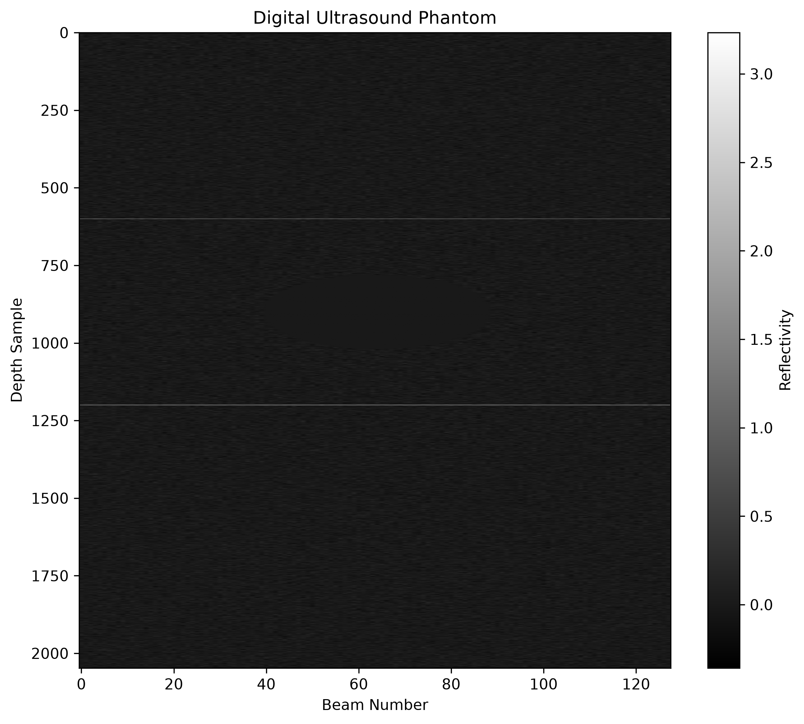
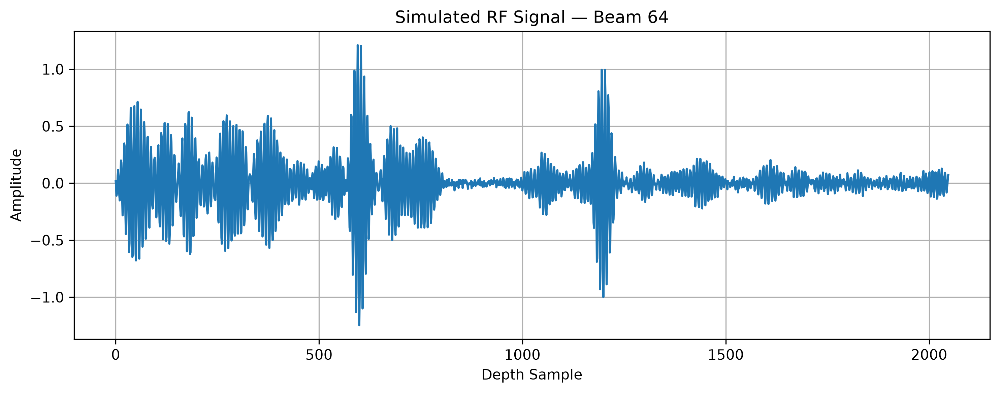
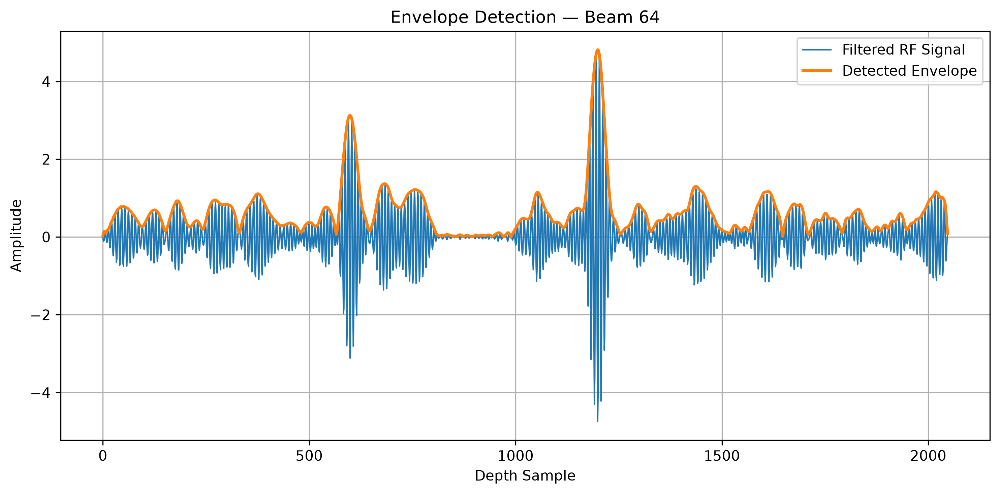
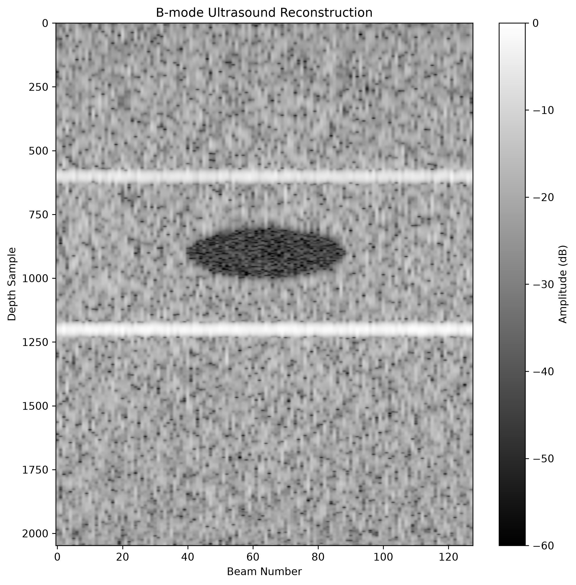

# B-Mode Ultrasound Image Reconstruction

A Python implementation of a simplified **B-mode ultrasound imaging pipeline** that simulates radiofrequency (RF) ultrasound signals and reconstructs grayscale medical images using digital signal processing (DSP) techniques.

This project demonstrates the complete imaging workflow from phantom generation to final B-mode visualization using NumPy, SciPy, and Matplotlib.

---

## Overview

Medical ultrasound systems do not directly produce images. Instead, an ultrasound probe transmits high-frequency acoustic pulses into tissue and records the returning radiofrequency (RF) echoes.

This project simulates that process by:

1. Creating a digital tissue phantom
2. Simulating RF echo signals
3. Applying common ultrasound signal processing techniques
4. Reconstructing a B-mode (brightness mode) ultrasound image

The implementation provides an educational demonstration of how ultrasound imaging systems transform raw RF data into diagnostic grayscale images.

---

## Features

- Digital phantom generation
- Random tissue scatterers (speckle simulation)
- Circular cyst simulation
- Multiple tissue reflectors
- RF echo simulation using pulse convolution
- Depth-dependent attenuation
- Time Gain Compensation (TGC)
- Butterworth bandpass filtering
- Hilbert transform envelope detection
- Log compression
- B-mode image visualization

---

## Reconstruction Pipeline

```
Digital Phantom
        │
        ▼
RF Signal Simulation
        │
        ▼
Depth Attenuation
        │
        ▼
Time Gain Compensation (TGC)
        │
        ▼
Butterworth Bandpass Filter
        │
        ▼
Hilbert Transform
        │
        ▼
Envelope Detection
        │
        ▼
Log Compression
        │
        ▼
B-Mode Ultrasound Image
```

---

## Project Structure

```
UltrasoundReconstruction/

│
├── data/
│   └── simulated_rf.npy
│
├── generate_simulated_rf.py
├── processing.py
├── visualization.py
├── main.py
│
├── README.md
└── requirements.txt
```

---

# Signal Processing Stages

## 1. Phantom Generation

A digital phantom represents tissue reflectivity.

The phantom contains:

- Random scatterers
- Bright tissue boundaries
- Circular cyst

Example:

```
-----------------------
Background Tissue

      (Cyst)

-----------------------
Reflector

-----------------------
```

---

## 2. RF Signal Simulation

Each reflector generates an ultrasound echo.

Instead of using simple spikes, the project creates a **5 MHz ultrasound pulse** and convolves it with each scan line.

This more closely models real ultrasound physics.

---

## 3. Depth Attenuation

Ultrasound waves lose energy while traveling through tissue.

The simulation models attenuation using an exponential decay:

```
A(d) = exp(-αd)
```

This causes deeper echoes to appear weaker.

---

## 4. Time Gain Compensation (TGC)

Because deeper echoes become weaker, ultrasound machines amplify signals based on depth.

The project implements Time Gain Compensation to restore deeper echoes before reconstruction.

---

## 5. Butterworth Bandpass Filter

The simulated RF signal contains broadband noise.

A fourth-order Butterworth bandpass filter removes unwanted frequencies while preserving the probe's operating bandwidth.

Implemented using:

- scipy.signal.butter()
- scipy.signal.filtfilt()

---

## 6. Envelope Detection

RF signals oscillate rapidly and cannot be displayed directly.

The analytic signal is computed using the Hilbert Transform:

```
Envelope = |Hilbert(RF)|
```

The resulting envelope represents echo strength.

---

## 7. Log Compression

Ultrasound echoes span a very large dynamic range.

Logarithmic compression converts echo amplitudes into decibel values suitable for image display.

```
B = 20 log10(A)
```

The image is clipped to a 60 dB display range.

---

## 8. B-Mode Visualization

The processed envelope is displayed as a grayscale image where:

- Bright pixels represent strong reflections
- Dark pixels represent weak or absent reflections

---

# Technologies Used

- Python
- NumPy
- SciPy
- Matplotlib

---

# Requirements

Install dependencies:

```bash
pip install numpy scipy matplotlib
```

---

# Running the Project

Generate RF data:

```bash
python generate_simulated_rf.py
```

Reconstruct the image:

```bash
python main.py
```

---

# Example Output

The generated B-mode image includes:

- Speckle background
- Bright tissue boundaries
- Dark circular cyst
- Simulated attenuation effects

# Example Results

## Digital Phantom

The simulated phantom contains background tissue scatterers, two reflective tissue boundaries, and a low-reflectivity cyst.



## Simulated RF Signal

Example RF echo signal generated from one ultrasound beam.



## Envelope Detection

The Hilbert transform extracts the echo envelope from the oscillating RF signal.



## B-Mode Ultrasound Reconstruction

The reconstructed grayscale B-mode ultrasound image after signal processing.



```
Example:

------------------------
Bright Reflector

       ███████
      ██     ██
      ██CYST ██
      ██     ██
       ███████

Bright Reflector
------------------------
```

---

# Educational Concepts Demonstrated

This project demonstrates several important digital signal processing and medical imaging concepts:

- Digital signal processing (DSP)
- RF signal simulation
- Linear systems and convolution
- Bandpass filtering
- Hilbert transform
- Envelope detection
- Dynamic range compression
- Ultrasound image formation
- Medical image visualization

---

# Future Improvements

Potential extensions include:

- Gaussian-modulated ultrasound pulses
- Scan conversion
- Multiple cysts and tumors
- Beamforming
- Point spread function modeling
- Real RF ultrasound datasets
- Interactive phantom generation
- 3D ultrasound simulation

---

# References

- Jensen, J. A. *Linear Description of Ultrasound Imaging Systems.*
- Szabo, T. L. *Diagnostic Ultrasound Imaging: Inside Out.*
- SciPy Signal Processing Documentation
- NumPy Documentation

---

# License

This project is provided for educational and research purposes.
